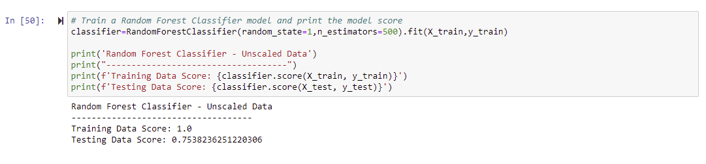
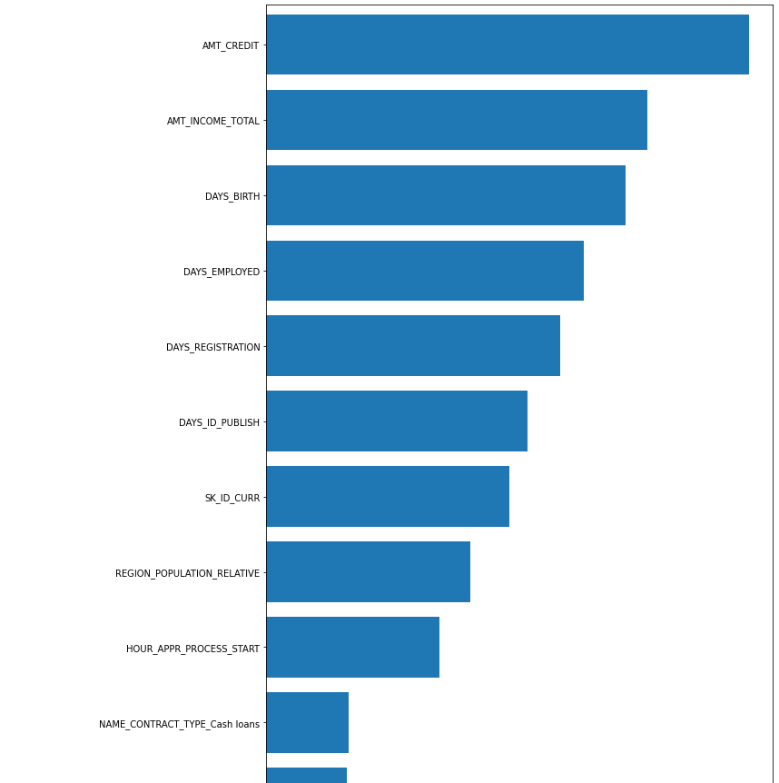
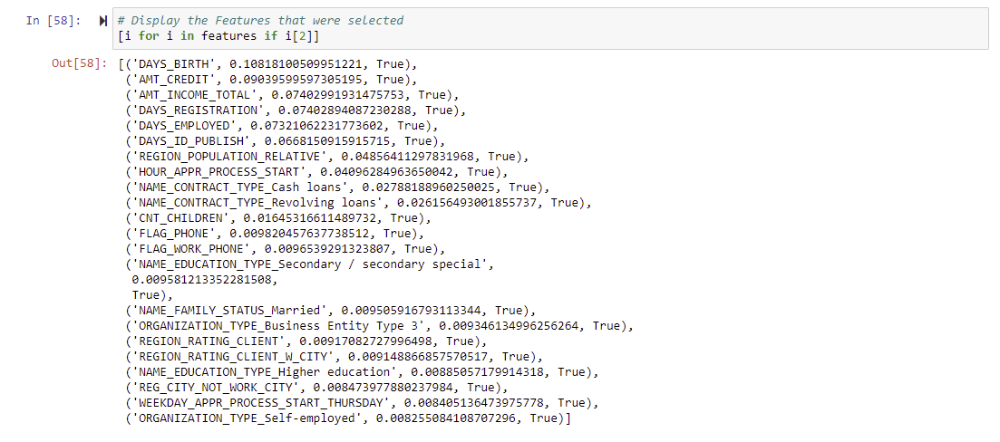
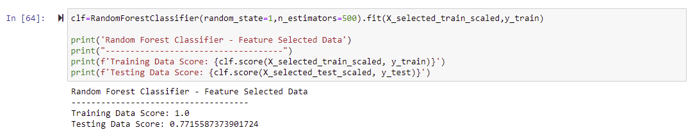
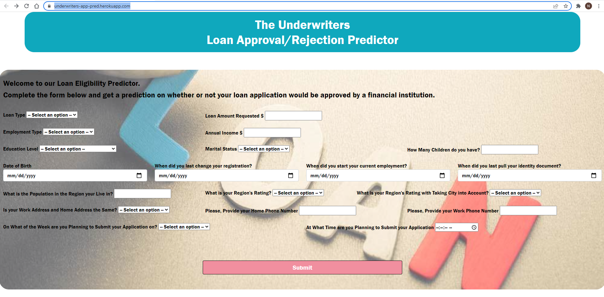

# Project 4 - Loan Eligibility Predictor
### Group Project To Use Machine Learning for Predicting The Approval Or Denial of a Loan Application
This repository has been created and used for the development of a Loan Eligibility Application as part of the final team project of the GATECH Data Science and Analytics Bootcamp.

## Project Team (The Underwriters)
1. [Rajeshwari Natchiappan](https://github.com/RajiNatch)
2. [Corey Chickowski](https://github.com/cchickowski)
3. [Nazih Bouanani](https://github.com/NazihZaz)
4. [Shailesh Godkhindi](https://github.com/sgodkhindi)

## Key Deliverables
### Project Presentation
[Slide_Deck](Project-4-Presentation.pptx)

### Jupyter Notebook + Machine Learning Model
- [Credit Evaluator Machine Learning Notebook](Credit_Risk_Evaluator.ipynb)
- [Credit Evaluator Machine Learning Model](Credit_Risk_Evaluator_Model.zip)
- [Scalar File](scaler.sav)

### Web Application + Flask
- [Web Application](webpage/app.py)

### Deployed Application
- [Live Web Application](http://3c63-2600-1700-42d2-a840-f0d3-73ef-cad8-dac8.ngrok.io/)

## Objective
The objective was to create and train a **Machine Learning Model** to evaluate a loan application based on various parameters and make a predication for approval or denial. Once the machine learning model was created and trained, our objective was to use it in a **Flask-based Web Application** to accept loan applications and predict whether they can be `approved` or `denied`.  

## Machine Learning Model Development Process

### Beginning the data-gathering process
In order to build and train our Machine Learning Model, we found this excellent dataset on Kaggle:
https://www.kaggle.com/c/home-credit-default-risk/data

* This dataset had a large number of records (150000+) based on **actual loan applications** across multiple columns. 
* It also came with it's detailed [Data_Dictionary](Data_Dictionary.csv)

### Data Analysis Preparation
1. The first thing was to load the [Training Dataset](Resources/application_train.csv) into a Pandas Dataframe
2. This is a huge file with **150000+ rows** and **122 columns**
3. Once loaded, we dropped all columns that had all `NaN` values using the `dropna(axis=1)` method. This brought down the number of columns to 55.
4. We further removed the columns that had very few non-null values to select 34 columns.

### Undersampling The Data
1. To ensure that our Training data is balanced and not Oversampled, we undersampled it
2. To do so, we used the NearMiss module which is part of the `imblearn` library.
3. The following code snippet describes it along with the net result:

### Working with Unscaled Data
1. Once the data was cleansed and balanced, we ran the engine on unscaled data.
2. We chose the **RandomForestClassifier** method due to nature of our requirement.
3. Our model `Testing Score` was around `.7538`.

### Scaling and Feature Selection
1. The next step in our process was to fine tune our Model and improve our **Testing Score**
2. To do that we first **Scaled** the data. 
3. Following the scaling we used the **Feature Selection** method to further reduce the Features
4. Feature Selection resulted in the following graph showing the key features that would improve our model

5. The following columns were selected by the model for classification:

#### Developing Final Score and Model 
1. Once the Feature Selection was complete we reran our model using the **RandomForestClassifier** and were able to improve the score to **over 77%**.

2. Once we reviewed the score, we saved our model to `pickle` file which we could then invoke within our **Web Application**.

## Web Application
In order to use our Machine Learning model, we created a **Flask-based** Web Application, which would: 
1. Allow the user enter a Loan Application on a web page.
2. Invoke the Machine Learning Model within the application.
3. Predict, based on the data provided, whether the Loan Application will be **Approved** or **Denied**.

4. We were able to **Deploy** the Web Application using `Ngrok`.

## Conclusion
In this project we were able to explore the *practical side* of **Machine Learning** which allowed us not only *develop and train* a Machine Learning Model, but also use the resultant model within a Web-based Application to solve a real-life problem.

